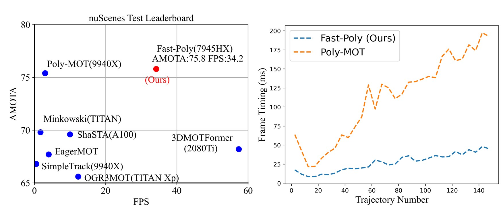

# Fast-Poly
[](https://paperswithcode.com/sota/3d-multi-object-tracking-on-nuscenes?p=fast-poly-a-fast-polyhedral-framework-for-3d)

This is the Official Repo For the RAL 2024 Accepted Paper "Fast-Poly: A Fast Polyhedral Framework For 3D Multi-Object Tracking"



> [**Fast-Poly: A Fast Polyhedral Framework For 3D Multi-Object Tracking**](https://arxiv.org/abs/2403.13443),  
> Xiaoyu Li<sup>\*</sup>, Dedong Liu<sup>\*</sup>, Yitao Wu<sup>\*</sup>, Xian Wu<sup>\*</sup>, Jinghan Gao, Lijun Zhao         
> *arXiv technical report ([arXiv 2403.13443](https://arxiv.org/abs/2403.13443))*,  

### [paper](https://arxiv.org/abs/2403.13443) | [youtube](https://www.youtube.com/watch?v=nFmeL_PjOyA&ab_channel=LIXIAOYU) | [bilibili](https://www.bilibili.com/video/BV1iz421Z7qj/?vd_source=b170cf0cb90cd4c536ec11f67c9f6522)

## abstract

3D Multi-Object Tracking (MOT) captures stable and comprehensive motion states of surrounding obstacles, essential for robotic perception. 
However, current 3D trackers face issues with accuracy and latency consistency. 
In this paper, we propose Fast-Poly, a fast and effective filter-based method for 3D MOT.
Building upon our previous work Poly-MOT, Fast-Poly addresses object rotational anisotropy in 3D space, enhances local computation densification, and leverages parallelization technique, improving inference speed and precision.
Fast-Poly is extensively tested on two large-scale tracking benchmarks with Python implementation.
On the nuScenes dataset, Fast-Poly achieves new state-of-the-art performance with 75.8\% AMOTA among all methods and can run at 34.2 FPS on a personal CPU.
On the Waymo dataset, Fast-Poly exhibits competitive accuracy with 63.6\% MOTA and impressive inference speed (35.5 FPS).


## News

- 2024-10-03. **The code of Fast-Poly is released :rocket:.**
- 2024-09-27. Fast-Poly is accepted at IEEE RA-L 2024 with ICRA 2025 :smiley:.
- 2024-09-19. Warm-up 🔥! We released [Rock-Track](https://arxiv.org/pdf/2409.11749), a 3D MOT method for multi-camera detectors based on our previous method [Poly-MOT](https://github.com/lixiaoyu2000/Poly-MOT). Welcome to follow.
- 2024-07-30. We revise the [paper](https://arxiv.org/abs/2403.13443), mainly including adding an in-depth discussion of A-gIoU. Welcome to follow.
- 2024-03-20. Warm-up :fire:! The official repo and [paper](https://arxiv.org/abs/2403.13443) of Fast-Poly have been released. Welcome to follow.
- 2024-03-18. Our method ranks first among all methods on the nuScenes tracking benchmark :fire:.


## TODO list

- 2024-10-03. merge multi-processing function, and support Waymo dataset.

## Main Results

### [nuScenes](https://www.nuscenes.org/tracking?externalData=all&mapData=all&modalities=Any)

#### 3D Multi-object tracking on nuScenes test set

 Method       | Detector      | AMOTA    | MOTA     | FPS      |   
--------------|---------------|----------|----------|----------|
 Fast-Poly    | LargeKernel3D | 75.8     | 62.8     | 34.2     |
 Poly-MOT     | LargeKernel3D | 75.4     | 62.1     | 3        |         
 
#### 3D Multi-object tracking on nuScenes val set

 Method        | Detector        | AMOTA    | MOTA     | FPS      |   
---------------|-----------------|----------|----------|----------|
 Fast-Poly     | Centerpoint     | 73.7     | 63.2     | 28.9     |  
 Poly-MOT      | Centerpoint     | 73.1     | 61.9     | 5.6      |  
 Fast-Poly     | LargeKernel3D   | 76.0     | 65.8     | 34.2     |  
 Poly-MOT      | LargeKernel3D   | 75.2     | 54.1     | 8.6      |

### [Waymo](https://waymo.com/open/challenges/2020/3d-tracking/)

### 3D Multi-object tracking on Waymo test set

 Method        | Detector        | MOTA     | FPS      |  
---------------|-----------------|----------|----------|
 Fast-Poly     | CasA            | 63.6     | 35.5     |  
 CasTrack      | CasA            | 62.6     | --       |

### 3D Multi-object tracking on Waymo val set

 Method        | Detector        | MOTA     | FPS      |   
---------------|-----------------|----------|----------|
 Fast-Poly     | CasA            | 62.3     | 35.5     |  
 CasTrack      | CasA            | 61.3     | --       |

## Use Fast-Poly on nuScenes

### 1. Create and activate environment
```
   conda env create -f environment.yaml  
   conda activate fastpoly
```

### 2. Required Data

#### Prepare necessary file for the Fast-Poly inference. [[Download](https://drive.google.com/drive/folders/1NVYs1CRqulES-Vr6oSoD3YxlkrszKuz8?usp=sharing)]

Fast-Poly is built upon Poly-MOT and utilizes the same file for inference. For details on preparing the necessary files, please refer to the [Poly-MOT repository](https://github.com/lixiaoyu2000/Poly-MOT/tree/main). The required files include:
- The ordered 3D detector,
- The token table for initializing the tracker in each scene,
- The database for evaluation.

### 3. Running and Evaluation

#### Config
All hyperparameters are encapsulated in `config/nusc_config.yaml`, you can change the `yaml` file to customize your own tracker.
**The accuracy with `CenterPoint` in the paper can be reproduced through the parameters above the current `nusc_config.yaml`.**

We also provide the tracking result [evaluation file](https://drive.google.com/drive/folders/1NVYs1CRqulES-Vr6oSoD3YxlkrszKuz8) on nuScenes val set under the above configuration.


#### Running
After downloading and organizing the detection files, you can simply run:
```
python test.py
```
The file path(detector path, token path, database path, etc.) within the file needs to be modified. 
Besides, you can also specify the file path using the terminal command, as following:
```
python test.py --eval_path <eval path>
```

#### Evaluation
Tracking evaluation will be performed automatically after tracking all scenarios.


### 4. Auto-finetune
The TBD trackers are often constrained by the need to optimize hyperparameters. 
To address this, we have developed a parameter linear search system. 
This functionality can be enabled by modifying the `test.py` script as follows:

```
if __name__ == "__main__":
    # single inference, load and save config
    config = yaml.load(open(args.config_path, 'r'), Loader=yaml.Loader)

    # run Poly-MOT
    run_nusc_polymot(config, args.result_path, args.eval_path)

    # multi inference, linear search parameters
    # linear_search_parameters([1, 11], 1, 'voxel_mask_size')
```

To activate the automatic parameter adjustment function, comment out the `run_nusc_polymot` call 
and uncomment the `linear_search_parameters` line. 
The example provided demonstrates a search for the optimal `voxel_mask_size`, 
exploring the range from `1m to 11m` with a step size of `1m`.


## Visualization
Please refer to our previous method Pol[](https://github.com/lixiaoyu2000/Poly-MOT/tree/main?tab=readme-ov-file#visualization)y-MOT for detailed visualization information

## Contact

Any questions or suggestions about the paper/code are welcome :open_hands:! 
Please feel free to submit PRs to us if you find any problems or develop better features :raised_hands:!

Xiaoyu Li(李效宇) lixiaoyu12349@icloud.com.

## License

Fast-Poly is released under the MIT license.

## Citation
If you find this project useful in your research, please consider citing by :smile_cat::
```
@misc{li2024fastpoly,
      title={Fast-Poly: A Fast Polyhedral Framework For 3D Multi-Object Tracking}, 
      author={Xiaoyu Li and Dedong Liu and Yitao Wu and Xian Wu and Lijun Zhao and Jinghan Gao},
      year={2024},
      eprint={2403.13443},
      archivePrefix={arXiv},
      primaryClass={cs.CV}
}
```
```
@inproceedings{li2023poly,
  title={Poly-mot: A polyhedral framework for 3d multi-object tracking},
  author={Li, Xiaoyu and Xie, Tao and Liu, Dedong and Gao, Jinghan and Dai, Kun and Jiang, Zhiqiang and Zhao, Lijun and Wang, Ke},
  booktitle={2023 IEEE/RSJ International Conference on Intelligent Robots and Systems (IROS)},
  pages={9391--9398},
  year={2023},
  organization={IEEE}
}
```